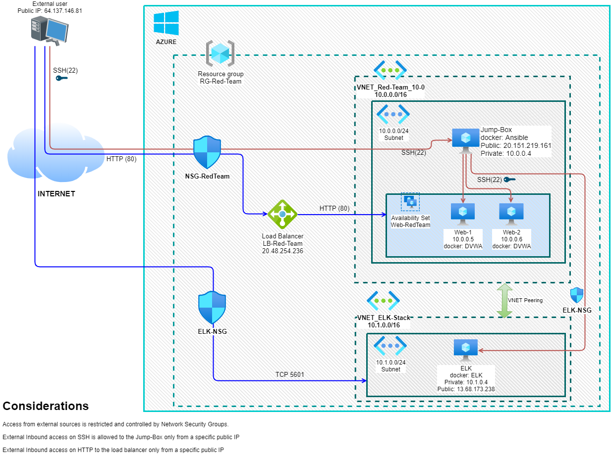

# DVWA-ELK-Project

## Automated ELK Stack Deployment

The files in this repository were used to configure the network depicted below.

[Azure network diagram](Images/Azure_Architecture.png)

These files have been tested and used to generate a live ELK deployment on Azure. They can be used to either recreate the entire deployment pictured above. Alternatively, select portions of the Playbook file may be used to install only certain pieces of it, such as Filebeat.

  - [Webservers Deployment Playbook](Playbooks/Webservers_Deployment.yml)

This document contains the following details:
- Description of the Topology
- Access Policies
- ELK Configuration
  - Beats in Use
  - Machines Being Monitored
- How to Use the Ansible Build

### Description of the Topology

The main purpose of this network is to expose a load-balanced and monitored instance of DVWA, the D*mn Vulnerable Web Application.

Load balancing ensures that the application will be highly available, in addition to restricting access to the network.
- With the load balancer we can ensure the **availablity** of the web application and, at the same time, enhance the security by allowing only specific incoming traffic.
- The jump box provides a secure way to access the environment for management purposes, as it is the only box allowed to reach other VMs internally. Therefore, we ensure that access to this VM is allowed only from an specific IP and at the same time using SSH keys.

Integrating an ELK server allows users to easily monitor the vulnerable VMs for changes to the OS and system configuration.
- **Filebeat** is watching for the system logs.
- **Metricbeat** is recording the Docker metrics.

The configuration details of each machine may be found below.

| Name     | Function | IP Address | Operating System |
|----------|----------|------------|------------------|
| Jump-Box | Gateway  | 10.0.0.4   | Linux-Ubuntu     |
| Web-1    |Web Server| 10.0.0.5   | Linux-Ubuntu     |
| Web-2    |Web Server| 10.0.0.6   | Linux-Ubuntu     |
| ELK      |Elk Stack | 10.1.0.4   | Linux-Ubuntu     |

### Access Policies

The machines on the internal network are not exposed to the public Internet. 

Only the Jump-Box machine can accept connections from the Internet. Access to this machine is only allowed from the following IP addresses:
- 64.137.146.81

Machines within the network can only be accessed by the Jump-Box using SSH.

The following picture displays the Red Team Network Security Group (NSG) configuration:

[NSG-RedTeam](Images/NSG-RedTeam.png)

A summary of the access policies in place can be found in the table below.

| Name     | Publicly Accessible | Allowed IP Addresses |
|----------|---------------------|----------------------|
| Jump Box | Yes                 | 64.137.146.81        |
| Load Balancer | Yes                 | 64.137.146.81        |
| Web-1    | No                  | 10.0.0.4             |
| Web-2    | No                  | 10.0.0.4             |
| ELK      | No                  | 10.0.0.4             |

### Elk Configuration

Ansible was used to automate configuration of the ELK machine. No configuration was performed manually, which is advantageous because it provides better management, and it is easy to reconfigure and deploy.

The playbook implements the following tasks:
- Use _sysctl_ module to increase the amount of memory that can be used.
- Install docker.io using _apt install_ command tu support the docker instances to be deployed.
- Install python3-pip using _apt install_ command
- Install the docker module using _pip_ command
- By using the docker_container module we download and install the docker image sebp/elk version 761

The following screenshot displays the result of running `docker ps` after successfully configuring the ELK instance.

[ELK Docker result](Images/ELK_docker.png)

The following screenshot displays the ELK NSG:

[ELK NSG](Images/NSG-ELK.png)

### ELK Results

The following images displays the results of a proper configuration and information being reported.
- [Filebeat configuration](Images/Syslog_config.png)
- [Filebeat dashboard](Images/Syslog_dashboard.png)
- [Metricbeat configuration](Images/Docker_metrics_config.png)
- [Metricbeat dashboard](Docker_metrics.png)

### Target Machines & Beats
This ELK server is configured to monitor the following machines:
- Web-1 (10.0.0.5)
- Web-2 (10.0.0.6)

We have installed the following Beats on these machines:
- FileBeat
- MetricBeat

These Beats allow us to collect the following information from each machine:
- **Filebeat** allows us to collect system logs which could be used to track specific security related system events.
- **Metricbeat** in the other hand is gathering specific information about docker performance, which is helpful to monitor network connectiviry, bandwidth, etc.

### Using the Playbook
In order to use the playbook, you will need to have an Ansible control node already configured. Assuming you have such a control node provisioned: 

SSH into the control node and follow the steps below:
- Copy the playbook file to /etc/ansible.
- Update the _hosts_ file to include the target servers.
- Run the playbook, and navigate to one of the web applications to check that the installation worked as expected.

- _Which file is the playbook? Where do you copy it?_
   The playbook is the YAML file, and we copied it to /etc/ansible
- _Which file do you update to make Ansible run the playbook on a specific machine? How do I specify which machine to install the ELK server on versus which to install Filebeat on?_
   We updated the hosts file, and we specify the machine(s) by creating collections.
- _Which URL do you navigate to in order to check that the ELK server is running?
   

_As a **Bonus**, provide the specific commands the user will need to run to download the playbook, update the files, etc._
